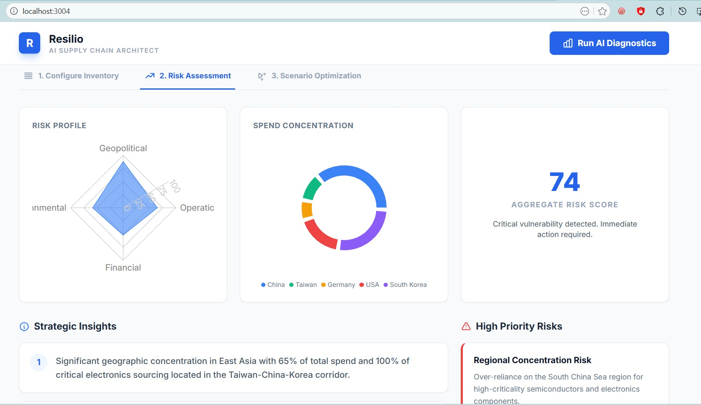

# Resilio: AI-Powered Supply Chain Risk Architect

<div align="center">



**Transform supplier data into strategic risk intelligence with AI**

</div>

---

## 📋 Overview

**Resilio** is an intelligent decision-support platform designed for Supply Chain Analysts and Business Operations Managers. By leveraging Generative AI (Google Gemini), it transforms raw supplier data into actionable risk intelligence, enabling proactive supply chain resilience strategies.

## 🎯 The Business Problem

Global supply chains face unprecedented volatility from geopolitical conflicts, environmental disasters, labor strikes, and regulatory changes. Traditional analytics dashboards excel at showing *what happened*, but fail to answer:

- **What could happen?** → Predictive risk modeling
- **How should we respond?** → Strategic mitigation planning  
- **Where are we most vulnerable?** → Multi-dimensional risk assessment

Resilio bridges this gap by combining structured data analysis with AI-powered scenario planning.

## ✨ Core Capabilities

**Intelligent Risk Diagnostics** - Automated scoring across Geopolitical, Operational, Financial, and Environmental factors with real-time radar visualizations and spend concentration maps.

**Scenario Optimization Lab** - Interactive "What-If" engine simulating port closures, trade policy changes, supplier bankruptcies, and climate events on your specific supplier network.

**AI-Generated Mitigation Playbooks** - Strategic recommendations including diversification strategies, optimized buffer stocking, nearshoring opportunities, and contract restructuring based on network vulnerabilities.

## 🛠️ Technology Stack

| Layer | Technology | Purpose |
|-------|-----------|---------|
| **Frontend** | React (TypeScript) | Component-based UI architecture |
| **Styling** | Tailwind CSS | Utility-first responsive design |
| **Data Visualization** | Recharts | D3-powered interactive charts |
| **AI Engine** | Google Gemini Flash | Structured reasoning and scenario analysis |
| **Prompt Engineering** | JSON Schema Validation | Reliable, parseable AI outputs |

## 💡 Use Cases

- **Procurement Teams**: Identify high-risk suppliers before contract renewals
- **Operations Managers**: Simulate disruption scenarios and prepare contingency plans
- **Supply Chain Analysts**: Generate executive reports on network vulnerabilities
- **Strategic Planning**: Evaluate nearshoring vs. offshoring trade-offs

## 🚀 Getting Started

### Prerequisites
```bash
Node.js 18+
npm or yarn
Google Gemini API key
```

### Installation

```bash
# Clone the repository
git clone https://github.com/yourusername/resilio-supply-chain-risk-analyzer.git
cd resilio-supply-chain-risk-analyzer

# Install dependencies
npm install

# Configure environment variables
cp .env.example .env
# Add your Google Gemini API key to .env

# Run development server
npm run dev
```

Open [http://localhost:3000](http://localhost:3000) to view the application.

## 📊 Why This Project Matters

This portfolio demonstrates key competencies for Data/Business Analyst roles:

**Analytical Problem-Solving** - Decomposing complex global risks into quantifiable, actionable metrics

**Advanced AI Implementation** - Structured data reasoning with LLMs beyond simple chatbots

**Domain Expertise** - Deep understanding of supply chain concepts including lead times, spend concentration, supplier criticality, and risk cascades

**Data-to-Decision Pipeline** - Complete workflow from raw data ingestion to executive-ready strategic recommendations

**Technical Versatility** - Integration of modern web frameworks, AI APIs, and data visualization libraries

## 🔮 Future Enhancements

- [ ] Real-time news API integration for geopolitical event detection
- [ ] Machine learning models for lead time forecasting
- [ ] Multi-tier supplier network mapping (suppliers of suppliers)
- [ ] Automated alert system for emerging risks
- [ ] Executive dashboard exports (PDF/PowerPoint)

## 📝 License

This project is open source and available under the [MIT License](LICENSE).

